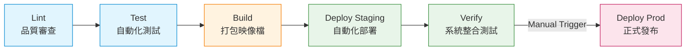

# 🚀 LLMOps IT Agent: Enterprise-Grade CI/CD Pipeline 實作

> **專案核心目標：** 從零搭建符合業界標準的六階段自動化管線，解決 AI 應用在開發（Dev）與營運（Ops）間的斷層。本專案已成功從「關鍵字 Mock 邏輯」進化為「真實 LLM 語意推理」，並實作雲端控管、本地執行的混合式部署架構。

---

## 📋 目錄
1. [專案動機與目的](#1-專案動機與目的)
2. [CI/CD 全自動管線架構](#2-cicd-全自動管線架構)
3. [六大階段詳解](#3-六大階段詳解)
4. [真實世界 vs. 本機模擬：架構對應圖](#4-真實世界-vs-本機模擬)
5. [技術亮點：LLM 整合與環境安全](#5-技術亮點llm-整合與環境安全)
6. [技術細節與問題解決](#6-技術細節與問題解決)
7. [如何重現此專案](#7-如何重現此專案)

---

## 1. 專案動機與目的
在 AI 應用快速迭代的時代，單純編寫模型邏輯已不足夠。本專案透過 **LLMOps** 的實踐，建立一套專業的軟體交付流程：
* **實踐 LLMOps 精神：** 確保 AI Agent 在更新模型提示詞（Prompt）或邏輯後，能透過自動化測試驗證語意識別正確性，降低人為部署錯誤。
* **技術力證明：**
    * 掌握 **GitLab CI/CD** 語法與階段規劃 (Pipeline as Code)。
    * 實作 **Docker** 容器化封裝與環境一致性。
    * 整合 **Google Gemini 2.5 Flash**，實作結構化輸出（Structured Outputs）。

---

## 2. CI/CD 全自動管線架構

本專案採用 6-Stage 流水線設計，模擬企業從程式碼提交到正式上線的完整生命週期：
`Lint` ➔ `Test` ➔ `Build` ➔ `Deploy (Staging)` ➔ `Verify` ➔ `Deploy (Prod)`

---

## 3. 六大階段詳解

### Stage 1: Lint (品質審查)
使用 `flake8` 進行靜態程式碼分析，確保符合 PEP 8 開發規範，維持代碼整潔與團隊協作一致性。

### Stage 2: Test (自動化測試)
利用 `pytest` 執行單元測試。此階段會注入 `GEMINI_API_KEY`，模擬真實請求驗證 AI 能否將「螢幕黑屏」等模糊描述準確歸類為「硬體設備」。

### Stage 3: Build (建置打包)
根據 `Dockerfile` 建置 Python 3.10 輕量化映像檔，並自動推送到 **GitLab Container Registry**。

### Stage 4: Deploy to Staging (自動化部署)
透過地端 **GitLab Runner** 驅動 `docker-compose`，自動拉取最新映像檔並部署。實作了「環境變數注入」機制，確保容器安全讀取 API Key。

### Stage 5: Verify (系統整合測試)
利用 PowerShell 對本機容器端點進行真實網路請求，驗證服務不僅成功啟動，且 AI 邏輯能正確響應。

### Stage 6: Deploy to Production (生產發布)
設定 **Manual Trigger (手動核准)** 機制。模擬企業最後核決流程，只有在開發者點擊確認後，系統才會執行正式發布指令。

---

## 4. 真實世界 vs. 本機模擬

| 流程階段 | 真實企業環境 (AWS/GCP) | 本專案模擬方案 |
| :--- | :--- | :--- |
| **Runner 執行環境** | 雲端託管機器人 (SaaS Runners) | **Local Windows Runner (Hybrid)** |
| **部署目標** | 遠端雲端伺服器 (EC2 / K8s) | **本機 Docker 容器** |
| **網路驗證** | 公網域名 / 內網負載平衡測試 | **PowerShell 內網穿透驗證** |
| **AI 邏輯** | 串接 OpenAI / 企業自建模型 | **Google Gemini 2.5 Flash API** |

---

## 5. 技術亮點：LLM 整合與環境安全

* **結構化輸出 (Structured Outputs)**：使用 `google-genai` SDK，透過 `response_schema` 強制模型輸出符合 Pydantic 模型定義的 JSON 格式，確保 API 穩定性。
* **12-Factor App 配置管理**：整合 `pydantic-settings`，實現「代碼與配置分離」。API Key 透過環境變數注入，本機使用 `.env`，雲端使用 `GitLab Variables`，兼顧開發便利與部署資安。
* **Docker 最佳化**：實作 `multi-stage` 式思路，利用 `.dockerignore` 確保不必要的快取與機密檔（如 `.env`）不進入映像檔。

---

## 6. 技術細節與問題解決

* **Windows 環境編碼衝突**：解決了 PowerShell 5.1 對 UTF-8 支援不佳導致的 CI 亂碼，全面升級至 **PowerShell 7 (pwsh)** 並優化 Runner 設定。
* **Git Index Lock 處理**：實作了自動化的清除腳本，避免 CI 指令意外中斷導致工作區卡死。
* **API Quota 與穩定性**：針對 Gemini Free Tier 的 `503 Service Unavailable` 錯誤，在 Pipeline 中建立錯誤處理機制與重試思維。

---

## 7. 如何重現此專案

### 🛠️ 必備工具
* 安裝 [Docker Desktop](https://www.docker.com/products/docker-desktop/)。
* 安裝 [PowerShell 7](https://github.com/PowerShell/PowerShell)。
* 下載 [GitLab Runner for Windows](https://docs.gitlab.com/runner/install/windows.html) (本機部署必備)。
* 註冊 [Google AI Studio](https://aistudio.google.com/) 並取得 `GEMINI_API_KEY`。

### 🚀 快速啟動
1.  **設定金鑰**：在專案根目錄建立 `.env` 檔案，填入 `GEMINI_API_KEY=你的金鑰`。
2.  **變數注入**：在 GitLab 專案設定的 `Settings > CI/CD > Variables` 中同樣新增 `GEMINI_API_KEY`。
3.  **啟動 Runner**：在本機切換到 Runner 所在目錄，執行 `.\gitlab-runner.exe run`。
4.  **推播代碼**：執行 `git push`，管線即會自動啟動並將服務部署至 `http://localhost:8000`。

---

### 技術棧 (Tech Stack)

* **Backend & Framework (後端與框架):**
  * `FastAPI`: 核心非同步 API 框架。
  * `Uvicorn`: 負責運行 FastAPI 的高效能 ASGI 伺服器。
  * `Pydantic V2` & `Pydantic-Settings`: 負責資料驗證與 12-Factor App 環境變數解析。
* **AI Integration (人工智慧整合):**
  * `Google GenAI SDK`: Google 最新的官方整合套件 (`google-genai`)。
  * `Gemini 2.5 Flash`: 負責核心語意分析與結構化推理。
* **Code Quality & Testing (品質與測試):**
  * `Pytest`: 負責單元測試與 API 驗證。
  * `Flake8`: 靜態程式碼審查 (Linting)，確保符合 PEP 8 規範。
  * `HTTPX`: 提供測試環境的非同步 HTTP 客戶端。
* **DevOps & Infrastructure (維運與基礎設施):**
  * `GitLab CI/CD`: 負責管線編排 (Pipeline as Code)。
  * `Docker` & `Docker-Compose`: 容器化與本地服務編排。
  * `GitLab Runner`: 實作地端部署的代理程式。
  * `PowerShell 7 (pwsh)`: 執行系統級網路穿透與自動化整合測試。
